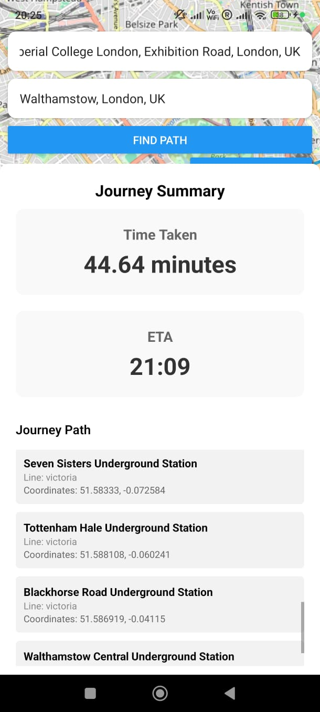
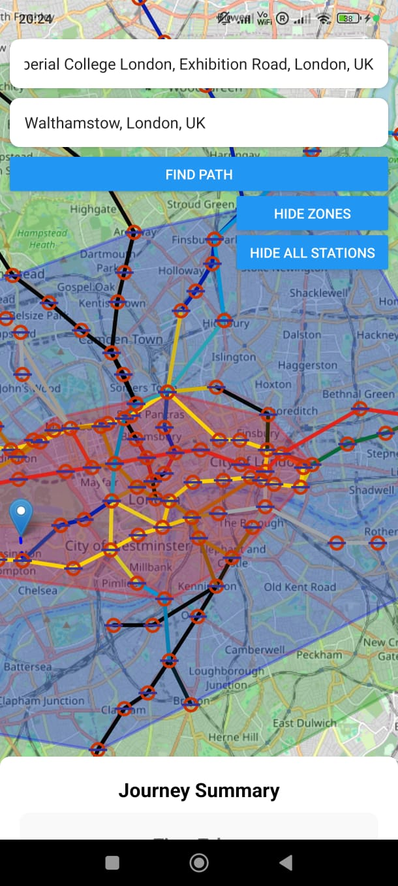
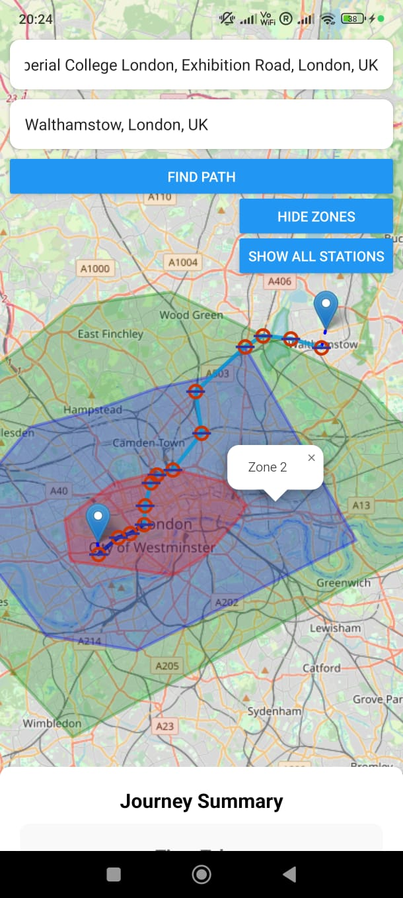
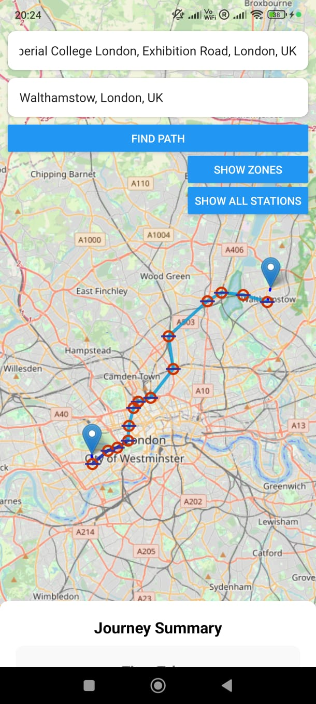
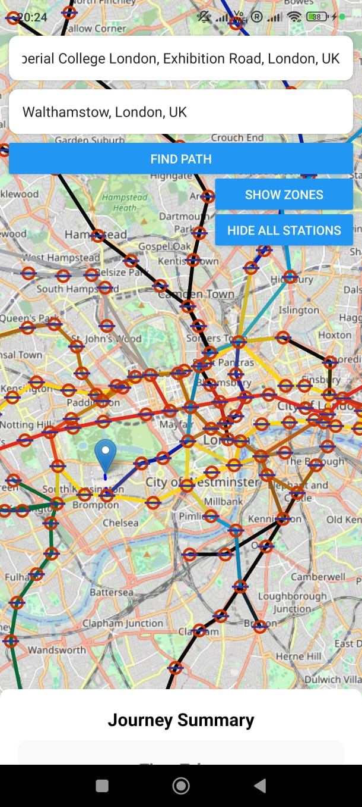

# Trasport-for-London-Underground Mobile App

## Final Result

<p align="center">
  
  
  
  
  
</p>

I have also created a video showing how the app feels with user interactions - here it is:
[Watch the demo video](img/runthrough.mp4)

## How to run

To run the backend, just run the commmand `.bat`, it should automatically start the cache and also get the server running in `port 5000` locally.

To run the front end, just run the command `npm start` and pick the Andriod option (At the current moment, since I dont have a Mac/iOS device, it makes iOS development really difficult)

### .env file 

Create a .env file in the `tfl_front_end_expo` folder and make sure it includes 
```
API_URL=XXXXXX
GOOGLE_PLACES_API_KEY=XXXXXX
```
where API_URL is the `localhost` IP and Google Places API Key is obtained from Google Web Services
> Note: Do not just put localhost for the API_URL it will not work put the IP address - e.g: http://127.0.0.1:5000

## Requirements
- In our program we use cache. Make sure to download _*Apache Ignite* (Binary Version)_ from this link: https://ignite.apache.org/download.cgi. Then navigate to the directory in cmd, then run `bin\ignite.bat`
- To fuffil the rest of the conditions please `pip install -r requirements.txt`

## Assumptions made whilst making this app
Of course this app was not made to be industry standard, but rather a fun exercise so there are assumptions that I made. Here they are:
- Always assume that the closest tube station is the station that will take the shortest time 
- Did not account for walking to tube station time - because I did not know how to figure out the walking path distance so I just ignored it since my main project was just for tubes anyways
- Assumed that the tubes were moving at constant speed (not accelerating or decelerating while passing stations - although added a fixed time of 2 minutes at each station)
- Assumed a fixed time of 5 minutes to change between lines
- Assumed that tubes travel in a straight line rather than in a curve/non linear fashion.

## Troubleshooting
*Common Problems*: 
- API_URL in app.json is not correct for different devices, go to app.json to change to backend location (do not use localhost, mobile cannot communicate)
- If there is an API related error, restart both the from end with `npm start --reset --cache` and the backend just run `.bat` again